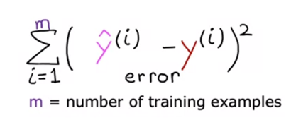
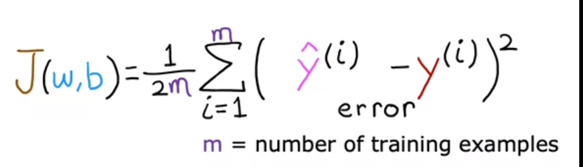

# Machine learning algorithms
- Supervised learning
- Unsupervised learning
## Supervised learning
- give system mutliple right answers 
  based on multiple right answers system will detect the next rigth answer for an unanswered question
- Spam filtering
- Speech recognition
- Machine translation
- Online advertising
- Self-driving car
- Visual inspection

### Regression
- Predict a number from infinitely many possibilities
- Can have infiite number of outputs for an input
- training set and testing set
- x as input (features) and y as output (target)
- m -> number of training examples (x,y); (x^i,y^i)
- n -> number of testing examples
- x -> f(x) -> Y; estimated -> Y-hat
- f(w,b)(x) = wx+b; f(x) = wx+b; b-> y intercept, x -> slope
 
#### Cost function
  - Parameters, weights, coefficients
  - Cost function
    - 
  - Squared error cost function: Cost function divided by 2m to average the cost during to large tarining set
    - 
  - Goal is to minimize the cost function J(w,b)
  - 

#### Gradient descent
- identifying the way to find the lowest possible cost
- identify the direction to decrease the cost from a given point iteratively
- Batch gradient descent
  - uses all training examples, not just a sample
  - 
##### Implementation
- w(i) = w(i-1) - a (d/dw) J(w(i-1),b(i-1))
- b(i) = b(i-1) - a (d/db) J(w(i-1),b(i-1))
- a -> learning rate; alpha
  - greater the a bigger the steps taken to find the lowest cost
  - always a positive number
  - if you are already at a local minimum, but the cost fn has 2 local minimums,
    - there is a chance to find 2 local minimums
    - Squared error cost funtion will only have 1 local minimum
- (d/dw) J(w(i-1),b(i-1)) -> derivative of the cost fn
  - decides direction to take the step and the size along with the a
  - slope of the function at a given point (y/x)
  - could be negative/ posyive slope
  - if negative slope, w increases, if positive. w decreases (moving it closer to the minimum)
- iterate until value reachs local minimum (converges)
    - value does not change much as compared tot he previous value
- simultaneously update w and b

### Classification
Classifying an input based on multiple correctly previously classified inputs
- Malignant tumor vs benign tumor
- Can have multiple classficiation
- Output classes/ output categories
- Numeric/ non-numeric
- Small number of possible outputs unlike regression, which gives infinite number of outputs
- Can have two or more inputs
- False negative, false positives (likelihood)
- Parameters for classification

### Unsupervised learning
- Find something interesting/ pattern in unlabeled data
- Clustering -> adding multiple data into clusters
    - Finding common parameters and grouping them into articles
    - DNA microarray
    - Finding structure in data
    - Grouping customers
- Anomaly detection
    - To detect unusual data points
- Dimensionality reduction
    - jed
- Recommending systems
- Reinforcement learning

#### 
